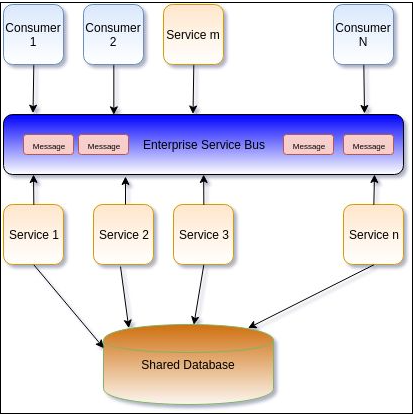

##  ¿No se parecen a SOA los microservicios?

La arquitectura de microservicio está inspirada en SOA. Su arquitectura parece SOA, pero hay diferencias que hacen microservice una versión más depurada y organizada de SOA. En SOA también, los problemas se dividen en servicios y, por lo general, todos utilizan SOAP como protocolo de mensajería para la comunicación.

Hay muchos consumidores conectados con muchos servicios a través del bus de servicio. Los consumidores pueden invocar cualquier servicio enviando un mensaje a través del ESB (Enterprise Service Bus). Al igual que en microservicio en SOA estos servicios pueden estar en el mismo lenguaje o en un lenguage diferente.

En SOA  la base de datos normalmente se comparte entre los servicios, mientras que en microservicios, cada servicio debe tener su propia base de datos y ningún otro servicio puede hacer frente a eso directamente.

SOA cree en el principio de compartir tanto como sea posible, por lo que SOA promueve compartir recursos como bases de datos entre diferentes servicios, lo que en realidad aumenta el acoplamiento entre servicios. Esto contradice la arquitectura del microservicio.

Los Microservicios cree en el principio de compartir lo menos posible. Esto cambia el enfoque fundamental del diseño de cualquier servicio en arquitectura.


La capa de comunicación ESB que es el middleware en SOA, se convierte en el único punto de fallo. En caso de fallo en ESB, ninguno de los servicios puede funcionar, consumir datos o hablar entre sí.

Los Microservicios se ocupa de este problema con el principio de falla en el aislamiento. Normalmente, los microservices hablan sobre RESTful, y elimina la necesidad de cualquier canal de comunicación de middleware pesado.

Otra implicación de SOA son los contratos de servicios. Como no hay noción de  contextos en SOA el mismo servicio puede realizar cambios en un modelo de datos diferente lo que lleva a un modelo de datos compartido. Este modelo de datos puede tener jerarquía o tipos de datos complejos. Los cambios en cualquiera de este modelo de datos, incluso con un solo campo, pueden resultar en el cambio de la interfaz en todos los servicios y en el despliegue de toda la aplicación.

La siguiente figura muestra la arquitectura típica de SOA Application:




SOA es un término muy amplio y los microservicios puede ser un subconjunto de SOA que tiene una granularidad más fina en torno al diseño orientado al servicio. Hay una famosa cita sobre Microservicios.


>"Los Microservicios son SOA pero hechos de una mejor manera".


## Asignación del dominio de negocios a componentes de microservicio

El diseño de una sólida arquitectura de microservicios comienza identificando el dominio del negocio, definiendo la capacidad alrededor de ese dominio y luego definiendo los microservicios a su alrededor.

La descomposición de un dominio de negocio se puede lograr con el concepto de diseño dirigido por el dominio (DDD), es un enfoque del desarrollo de software para necesidades complejas que conecta la implementación a un modelo en evolución.

El término DDD se introdujo en algún lugar en 2004 con palabras claves como el modelado, el contexto asociado, la entidad, el repositorio y el lenguaje omnipresente. Como DDD encaja perfectamente  con la idea de microservicios, este concepto es de nuevo obtener el relevancia debido a la popularidad de la arquitectura microservicio.

La filosofía de DDD es tratar de entender el dominio de un problema que estamos intentando  resolver y modelarlo alrededor de este dominio. Sugiere el modelado sobre la base de casos de uso reales del negocio. Este modelado incluye definir un conjunto de conceptos para el dominio, la capacidad del dominio y el contexto asociado alrededor de él. Hay algunos conceptos básicos en DDD, que son los siguientes:
___
### Correr tu primer spring boot

Para correr este ejemplo usamos maven

>$ mvn spring-boot:run

Todo esta parametrizado en el archivo src/main/resources/application.properties


```bash
server.port=8899
server.contextPath=/firstboot
```


http://localhost:8899/firstboot/greeting/{userName}

Podemos hacer la prueba usando [httpie](https://httpie.org/)

>$ http -f -b http://localhost:8899/firstboot/greeting/sidlors

Welcome, sidlors!


