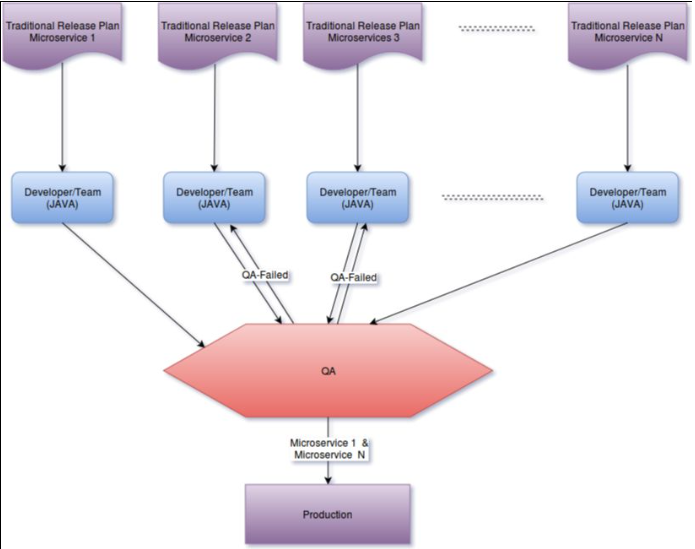

[toc]

# Microservicios

## Una Introducción a la Arquitectura de Microservicios

La arquitectura de software puede definirse como un conjunto de reglas o principios diseñados para un sistema que define los elementos, el comportamiento, la estructura y la relación entre los diferentes componentes de un sistema de software.

A principios de los años 80, cuando comenzaron a surgir sistemas de software a gran escala, surgió la necesidad de contar con patrones genéricos (o arquitectura) que resolvieran los problemas comunes que se planteaban al diseñar todos esos sistemas.

El término "arquitectura de software" comenzó a evolucionar desde allí. Desde entonces, se han introducido muchos tipos de arquitecturas para diseñar sistemas de software a gran escala. La industria del software ha visto estilos de arquitectura desde la *shared nothing* a la monolítica,  del tipo cliente-servidor a n-partes, pasando por la arquitectura orientada al servicio (SOA) y muchos más.
___

Una adición más a esta lista es la arquitectura microservice.

Microservice es una palabra que ha tomado un camino exponencial de popularidad en los últimos tiempos entre la comunidad de desarrolladores de software/arquitectura.

Las organizaciones que trabajan en arquitectura de aplicaciones monolíticas a menudo se quejan de largos ciclos de lanzamiento, tediosos problemas de depuración, alta complejidad en el mantenimiento, problemas de escalamiento, etc.

La lista nunca termina. Incluso las aplicaciones monolíticas excepcionalmente bien administradas requeriren un enorme esfuerzo para manejar estos problemas.

Los Microservicios está evolucionando rápidamente, ya que ofrece una manera eficiente de hacer frente a este tipo de problemas.

En palabras simples, podemos explicarlo como romper un problema grande en servicios relativamente más pequeños, y cada servicio jugará su propia parte.

La filosofía básica de la arquitectura de microservicios es

***"Hacer una cosa y hacerlo excepcionalmente bien"***

El corazón de la arquitectura de microservicios es el principio de responsabilidad única (SRP). En la arquitectura de microservicios, las tareas empresariales se dividen en tareas más pequeñas, y para llevar a cabo cada tarea, hay un microservicio.

En un sistema, podría haber dos microservicios o 100 microservicios, dependiendo de los requisitos del negocio y de la forma en que la tarea se ha desglosado.

Este tipo de arquitectura da a una organización muchos beneficios, que no eran posibles en aplicaciones monolíticas, sin dejar de mencionar que también tiene su propio tipo de overhead general también.

### Características de la Arquitectura de Microservicios

Cualquier arquitectura que demuestre los seis principios o características siguientes podría colocarse en la zona de la arquitectura del microservicio:

1. El sistema debe consistir en dos o más unidades o componentes corriendo. Estos componentes deben exponer su funcionalidad como servicios. Cada componente debe servir a un propósito de negocio, y los componentes deben ser bajamente acoplados. Los componentes deben comunicarse entre sí a través de protocolos standard, como colas de mensajes, HTTP  request/response, etc.
2. Los sistemas deben ser agnósticos del lenguaje. Un componente se puede desarrollar en Java, y otro se puede desarrollar en .NET. La decisión de elegir una plataforma tecnológica para un servicio en particular no debe afectar a la arquitectura de la aplicación.
3. Los sistemas deben tener una base de datos descentralizada. Idealmente, cada componente o microservicio debe tener su propia base de datos, con la que sólo ese servicio está interactuando. Ningún otro componente o servicio puede recuperar o modificar los datos de esa base de datos.
4. Cada componente del sistema debe ser cohesivo, independiente y autodesplegable. No debe depender de ningún otro componente o recurso para trabajar o desplegar. Debe tener Integración Continua y Despliegue Continuo (CI/CD) un empaquetado lo más eficiente posible.
5. El sistema debe tener pruebas automatizadas en si. La velocidad es una de las características más deseables de la arquitectura de microservicios. En el ciclo de construir, probar y enviar, si las pruebas automatizadas no están en su lugar, entonces no puede cumplir con la meta.
6. Cualquier fallo de un componente o servicio debe estar aislado. La falla de un servicio no debe hacer que la aplicación entera se vaya abajo. Si algo falla, no debe afectar a otros componentes y/o servicios. Algún tipo de mecanismo de devolución del fracaso debe estar en su lugar. Esto significa que si falla un servicio, debería ser fácil hacerle *rollback* a una versión de trabajo más antigua.
___
### Manejo de los servicios

El éxito de la arquitectura de microservicios se basa en la eficacia con la que se analiza el dominio del problema y se descompone la aplicación en componentes independientes más pequeños. Cuanto mejor se divida el problemas, mejor evolucionará la arquitectura.

___

La arquitectura típica de microservicios es como se muestra en el siguiente diagrama

____

* Por lo general cada equipo es responsable de un microservicio, variando el tamaño de cada equipo desde uno a varios membros dependiendo la complejidad del microservicio.

* Cada microservicio tiene su propio plan de relanzamiento o realease, el relanzamiento de una version del microservio no afecta al resto de los microservicios
  + Si por ejemplo en algun momento digamos 5 microservicios estan siendo probados por QA y solo dos pasan las pruebas para promoverlos a produccion estos no deben ser no promovidos a produccion devido al resto que aun no esta aprobados por QA.s

___

### Desafíos de una Arquitectura de Microservicios exitosa

La arquitectura de microservicio no es la panacea de todos los problemas de arquitectura en el mundo existente.

Nos da una solución a muchos de los problemas planteados, pero viene con sus propios desafíos.

* La descomposición de la base de datos
* La comunicación entre APIs
* Un trabajo pesado de DevOps
* Mentalidad de alianza Devops

Serian por mencionar algunos de los factores iniciales para hacer frente a los microservicios.

Incluso con la implementación exitosa de un microservicio, aquí están los desafíos que una organización se enfrentará.

___

#### Debugging atravez de archivos log

Debuggear en una arquitectura de microservicios sera compleja para el desarrollador, un simple consulta al aplicativo puede resultar en una descomposicion de llamados internos a multiples microservicios.

Cada microservicio generara su propio log, para localizar la causa de error de un request particular  podria volverse una pesadilla para el desarrollador. en un ambiente de traza distribuido es dificil dar al punto de error.

Utilizar alguna utileria o herramietas para centralizar las salidas de cada log sera lo recomendable.
___

#### Monitoring microservices

Las aplicaciones monoliticas son faciles de monitorear, pues los tienes agrupados en un punto comun (Todos ellos en un war 'gordo')

Los puntos a monitoerar incluyen servicios de tipo:

* Base de datos
* Espacio en disco
* Uso de cpu
* Alguna otra utileria de terceros.

Si esto mismo requerimos para cada microservicio el total de los puntos a monitorear se incrementa linealmente asi mismo el numeor de alertas.

Monitoreo y herramientas que midan su propia salud como Nagios o Monit deben de estar presentes para el manejo reactivo de alertas provenientes de los diferentes servicios.

#### Bibliotecas comunes

El uso de una biblioteca comunes entre diferentes servicios puede no ser una buena idea en una arquitectura de microservicios.

En un escenario que se antoja a compartir librearia seria por ejemplo cuando un microservicio_A genera el objeto usuario en JSON y otro microservicio_B consume el objeto usuario JSON. Todo apuntaria a que debemos definir un Jar common con la clase usuario y agregar ese JAR common en ambos microservicios.

Pero.. esto conduce a dos nuevas inconvenientes

* La primera es que compartir una biblioteca común volverá a conducir microservices a pegarse con el mismo lenguaje.

* En segundo lugar, esta idea aumentará el acoplamiento entre los servicios, lo que va en contra de la idea de microservicios.

Solución podría ser la clase de usuario debe escribirse en ambos microservicios.

Esto puede resultar una falta al principio de **No te repitas tu mismo** (DRY) *Don't Repeat Yourself*.
___

#### Mensajería entre servicios

En la arquitectura de microservicios, que sirve una única solicitud desde el exterior (cliente de interfaz o consumidor de API), puede resultar en múltiples comunicaciones internas entre diferentes microservicios, lo que puede resultar en una latencia de red.

Esto puede, a su vez, degradar el rendimiento global de la aplicación. Se puede resolver eligiendo el tipo correcto de comunicación entre APIs.

Puede ser síncrono como los servicios web RESTful o asíncronos como la mensajería. Dependiendo del requisito de la aplicación, ambos tipos de comunicación pueden coexistir en un solo lugar.

Si se requiere una respuesta directa, debe ser síncrona como HTTP. Si hay algún resultado intermedio que debería pasar al siguiente servicio o servicios, la mejor manera de hacerlo es publicando los eventos en temas o colas, como Kafka o SNSs.
___

#### Implementación y versionado de microservicios

Microservicios se pueden desplegar de diferentes maneras. Microservicios normalmente se envían con contenedores como empaquetados Dockers, o para **Amazon Web Services (AWS)**, también se puede usar **Amazon Machine Image (AMI)** para enviar el microservicio. Sin embargo, los AMI tardan más en crear y desplegar que Dockers.

Docker es una mejor herramienta para implementar un microservicio.

Deben establecerse las reglas correctas de control de versiones; De lo contrario, toda la arquitectura estará en un infierno de versionado.
___

Normalmente, **xx.xx.xx** es el formato de versiones.

* Los digitos del extrema derecha son ocupados para versiones fixes de bugs o parches más pequeños
* La sección media aumenta añadiendo cualquier característica nueva en el componente.
* El número más a la izquierda aumenta cuando se ha cambiado algo grande, por ejemplo el modelo de interfaz de comunicación.
___

## Futuro de los microservicios

Junto con sus pros y sus contras los microservices están ganando popularidad en estos días. Con cada vez más gente usando este concepto, puede haber nuevos problemas, nuevos patrones para implementar microservicios y nuevas demandas de los microservicios en la mesa.

Esas demandas y problemas comunes darán la dirección o liderarán el futuro de los microservicios.

___

Aumentar el número de microservicios en la organización también aumenta el trabajo de DevOps. Ahora DevOps tiene que lidiar con un montone de *pipelines* de despliegue, manejar logs en un lugar centralizado, monitorear servicios y atributos de servidor, script de auto-healing, etc.

Con una mentalidad de DevOps, los desarrolladores tienen mucho que hacer aparte de sólo desarrollar la lógica de negocio. Con un aumento en el esfuerzo DevOps, los microservicios podrían conducirnos en dos direcciones:

* Arquitectura *Serverless*
* Microservicios en modo PaaS

___

### Arquitectura *Serverless*

Arquitectura sin servidor, ya hay ofertas de este servicio con diferentes proveedores de la nube y no parece demasiado lejos.

Por ejemplo AWS tiene una característica increíble llamada función Lambda.

Normalmente como funciona es un branch de código en un archivo ZIP y se coloca en su entorno S3 de amazon.

Cada vez que se desencadena un evento específico, se crea una nueva instancia con parámetros predefinidos. Esta pieza de código particular se copia desde una ubicación especificada a la nueva instancia y este código comienza a ejecutarse.

Después de terminar su trabajo, la instancia se cerrará de nuevo.

Con el patrón de *services discovery* todo este concepto se vuelve muy interesante.

En este tipo de entorno, los servicios estarán subiendo y bajando según la demanda.
___
Cada nuevo servicio que llegue al ecosistema se registrará al subir y  se desregistrará al bajar; usando el protocolo *discovery* el resto de los servicio que lo el necesiten se comunican con el.

Esta arquitectura **no nos da toda la solución**, por ejemplo no explica el versionado de los servicios, ni cómo manejar el tiempo de latencia que los nuevos servicios bajo demanda tardan en aparecer para una nueva solicitud HTTP y demas.

El tiempo de arranque de la instancia y los servicios será crucial en este escenario. La evolución de este tipo de componente como Lambda de los proveedores de nube, puede conducir al futuro a menos componentes del servidor.

El desarrollador se centrará en el desarrollo de componentes de negocio. El trabajo de DevOps será menor en este caso.
___

###Microservicios como PaaS

Microservice como PaaS puede ser otra dirección de los Microservicios y ser entregados como Plataforma de servicios (PaaS).

Con herramientas de contenedores tales como **packer** o **Docker** esto también parece ser factible.

En este escenario los microservicios seran empaquetados junto con frameworks que realicen la mayor parte del monitoring, el logging, el reggistry, bibliotecas comunes, balanceadores de carga, control de versiones y  similares features de sí mismo.

Los contenedores están en el lugar que conducen microservices en algo de la misma dirección. Pueden ser vistos como un marco, viniendo con todo el monitoreo, registro y así sucesivamente ya en sí mismos. Los desarrolladores tienen que preocuparse menos por todas esas cosas.

A medida que las tecnologias de contenedores maduren y los componentes de la nube evolucionan podremos ver la fusión de ambas direcciones a un largo plazo.